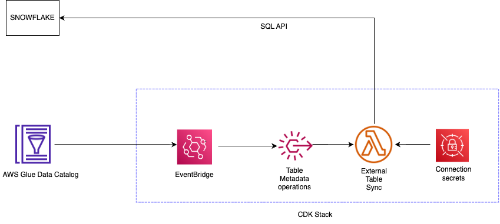

# AWS Glue Data Catalog table sync with Snowflake

Note: This is a sample script, not supported by AWS officially.
We recommend you to test and modify it for your use-case.

## Introduction

This provided scripts enables AWS Glue external table create and update event from cloudtrail to be published as corresponding Snowflake external table using Snowflake SQL API. External table should have data stored on Amazon S3 and can be partitioned hive style or simple non-hive style.



The following scenarios are supported:


### New external table creation in Glue 
External tables created/updated under the Glue database will produce cloudtrail events. These events are used to trigger corresponding external table sync in Snowflake using SQL API. External table should have data stored on Amazon S3 and can be partitioned hive style or simple non-hive style. Also the file format should be one of the allowed formats for Snowflake: CSV,JSON,PARQUET,ORC,AVRO.

Hive Style customer table with partition country and source:
```
customer/country=US/source=LOB1/data.json
```

Simple Non-Hive Style customer table with partition country and source:
```
customer/US/LOB1/data.json
```

### Existing external table schema update in Glue
External table schema changes including column and partition changes will produce cloudtrail events that trigger corresponding external table sync in Snowflake using SQL API. 

Note: Refer AWS Cloudtrail documentation for limitations on delivery of events. 

## Instructions

Below are instructions for setting up external table sync between Glue Data Catalog and Snowflake. 

### Prerequisites

1. Set up cloudtrail for AWS account where Glue Data catalog resides.(https://docs.aws.amazon.com/awscloudtrail/latest/userguide/cloudtrail-create-and-update-a-trail.html)

2. Create IAM role in the AWS account where Glue data catalog resides for Snowflake access.(https://docs.snowflake.com/en/user-guide/data-load-s3-config-storage-integration#creating-an-iam-policy)

3. Create STORAGE INTEGRATION for external S3 authentication from Snowflake account to AWS account(Glue Data Catalog) via IAM role created above with required S3 policies.(https://docs.snowflake.com/en/user-guide/data-load-s3-config-storage-integration)

4. Create S3 staging for bucket(s) and prefix that will act as Glue Table Storage location.(https://docs.snowflake.com/en/sql-reference/sql/create-stage#syntax)

5. Create Snowflake database and schema where the glue external tables will be created.(https://docs.snowflake.com/en/sql-reference/sql/create-database)

6. Create snowflake integration user and role for integration with GDC and grant required permissions to the integration role. 
    - Usage on Storage integration
    - Usage on Stage
    - Permission on Snowflake database and schema

7. Setup OAuth For SQL REST API(https://docs.snowflake.com/en/developer-guide/sql-api/authenticating)
    -  Create public and private key.
    -  Associate the public key with snowflake integration user

8. Create database in AWS Glue Data Catalog that matches database and schema in Snowflake following the format:
 
```
<snowflake_database_name>__<snowflake_schema_name>
```
Note: Double underscore between database name as schema name. If this pattern is not followed, table sync will fail. Changing the pattern will require changes to parsing logic within the Lambda.

### Deploy CDK

Clone this repository and change to project root folder.

cd <project_root_folder>

Use the requirements-layers.txt to download the packages for building Lambda layers. 

***Note: Use linux machine that is compatible to target Lambda architecture to download the packages.

Example:

```
pip3 install \
    --platform manylinux2014_x86_64 \
    --target=python \
    --implementation cp \
    --python 3.9 \
    --only-binary=:all: --upgrade \
-r <path_to_requirements>/requirements-layers.txt
```
Place the packages downloaded to python folder including the folder under <project_root_folder>/lambdalibpackages/.

To manually create a virtualenv on MacOS and Linux:

```
$ python3 -m venv .venv
```

After the init process completes and the virtualenv is created, you can use the following
step to activate your virtualenv.

```
$ source .venv/bin/activate
```

If you are a Windows platform, you would activate the virtualenv like this:

```
% .venv\Scripts\activate.bat
```

Once the virtualenv is activated, you can install the required dependencies.

```
$ pip install -r requirements.txt
```

At this point you can now synthesize the CloudFormation template for this code.

```
$ cdk synth --context environment=7_11_6
```

To deploy the stack. 

```
$ cdk deploy --context environment=7_11_6
```

To add additional dependencies, for example other CDK libraries, just add
them to your `setup.py` file and rerun the `pip install -r requirements.txt`
command.

This will create Stack containing the following resources:
- Secrets for storing target connection configuration
- Lambda Layer with additional packages
- Lambda function to process the event and transform the Glue table definition to corresponding Snowflake external table definition
- Lambda role with access to secrets and glue resources
- EventBridge with table create/update rule to trigger the lambda. You can also narrow event rule condition to specific database name pattern.


### Setup secrets

Once the stack is created, you can edit the generated secrets key with corresponding values:
- url: Snowflake SQL API Endpoint (https://docs.snowflake.com/en/developer-guide/sql-api/about-endpoints)
- accountidentifier : Account Identifier
- username : Integration user created for GDC Snowflake Sync
- warehouse : Compute associated with integration user
- role : Role associated with the integration user that has permission on database, schema, integration and stages.
- private_key : Content of the private key
- stages/s3: Dictionary of various s3 stages to s3 bucket/prefix created.
            "stages": {
                  "s3": {
                    "<DATABASE>.<SCHEMA>.<STAGE_NAME>": "<BUCKET_PATH>"
                  }
                }
    Example:
    ```
    "stages": {
                  "s3": {
                    "dev_db.public.customerstage": "s3://sample-customers-bucket123/"
                  }
                }
    ```
    
***Note: When you re-deploy CDK, secret values will need to be filled again.

### Setup External Table Auto Refresh

Follow the instruction to setup automatic refresh on external table metadata using Amazon SQS (Simple Queue Service) notifications for all the S3 buckets/prefixes. (https://docs.snowflake.com/en/user-guide/tables-external-s3#option-1-creating-a-new-s3-event-notification)

    
## Limitations
    
1. If you create a new storage integration (or recreate an existing storage integration using the CREATE OR REPLACE STORAGE INTEGRATION syntax), the resulting integration has a different external ID and so it cannot resolve the trust relationship unless the trust policy is modified.   
2. Refreshing External Tables Automatically for Amazon S3 is limited to Snowflake accounts on AWS.
3. When data is loaded to S3 before setting up automatic refresh, you will need to manually refresh the external table in Snowflake. 
4. Table format other than allowed file formats for Snowflake will not be synced.
5. Tables having user defined non-hive style format are not supported.

Refer to Snowflake and AWS documentation for other limitations.

    

    


